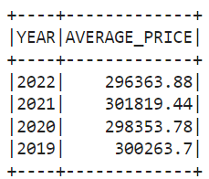
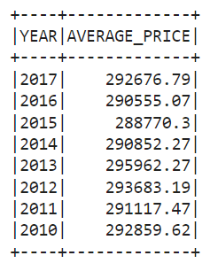
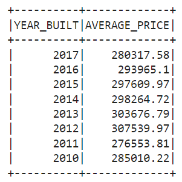
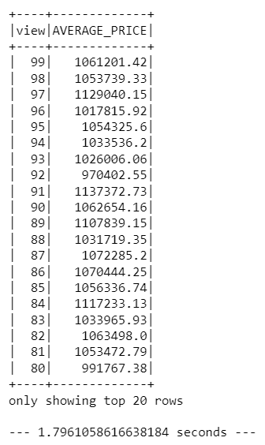
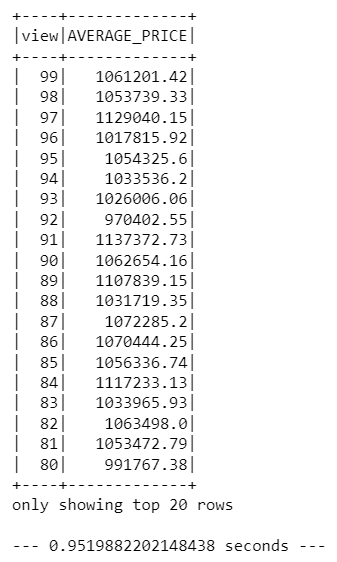
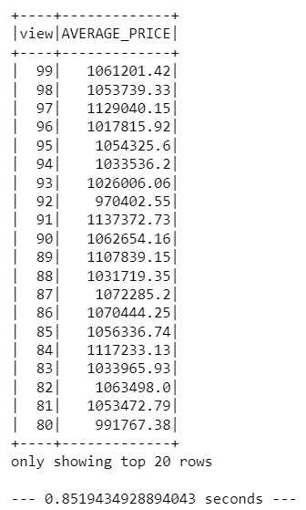

# Home_Sales
Challenge 22

In this challenge, you'll use your knowledge of SparkSQL to determine key metrics about home sales data. Then you'll use Spark to create temporary views, partition the data, cache and uncache a temporary table, and verify that the table has been uncached.

### The following questions are explored using SparkSQL:

- What is the average price for a four-bedroom house sold for each year? Round off your answer to two decimal places.

- What is the average price of a home for each year the home was built, that has three bedrooms and three bathrooms? Round off your answer to two decimal places.

- What is the average price of a home for each year the home was built, that has three bedrooms, three bathrooms, two floors, and is greater than or equal to 2,000 square feet? Round off your answer to two decimal places.

- What is the average price of a home per "view" rating having an average home price greater than or equal to $350,000? Determine the run time for this query, and round off your answer to two decimal places.

- Note the time to complete the last question.

### Cache the data and answer the latter question:
- Note the time difference.

### Partition the data and answer the same question:
- Again, note the time difference.

### Observations:

- Without caching or partitioning, the time to complete the question was 1.80 seconds.

- The time to complete improves with caching, at 0.95 seconds.

- Partitioning proved slightly faster, at 0.85 seconds.
